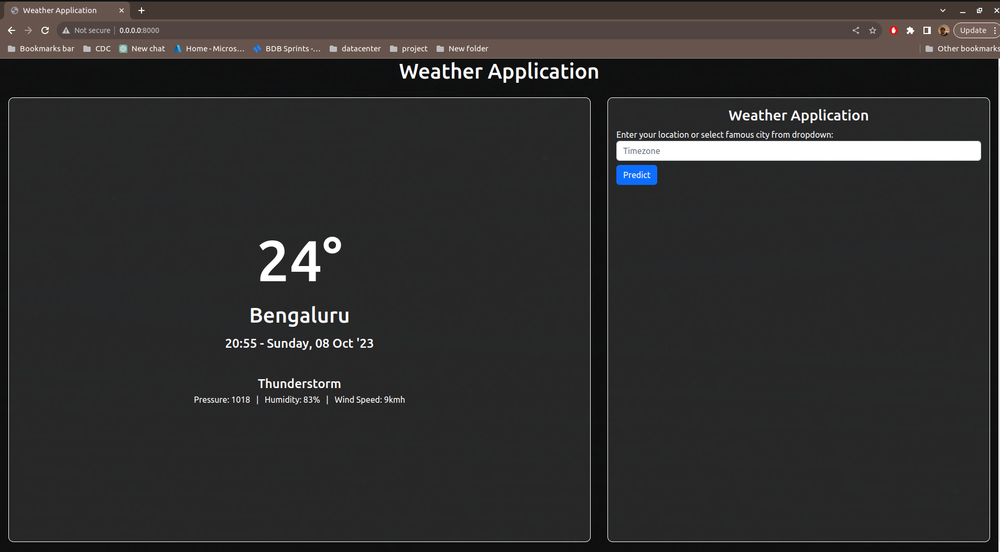
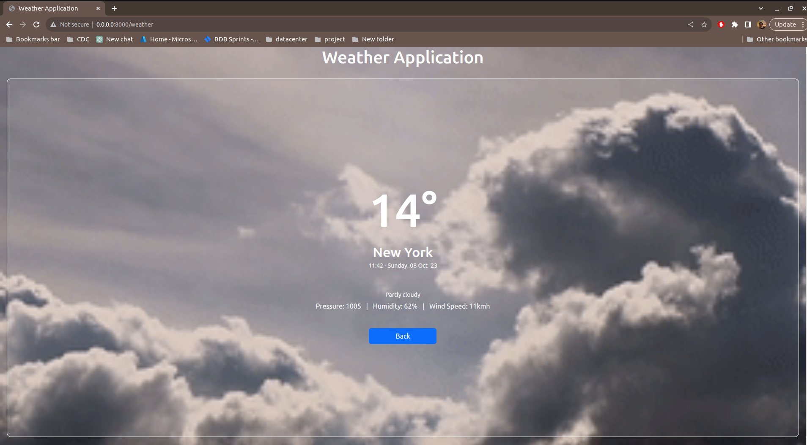

# weather-forcast


## Getting started

To make it easy for you to get started with Github, here's a list of recommended next steps.

Already a pro? Just edit this README.md and make it your own. Want to make it easy? [Use the template at the bottom](#editing-this-readme)!

## Add your files

- [ ] [Create](https://gitlab.com/-/experiment/new_project_readme_content:b35112c5d6f67495597a32a8c929a762?https://docs.gitlab.com/ee/user/project/repository/web_editor.html#create-a-file) or [upload](https://gitlab.com/-/experiment/new_project_readme_content:b35112c5d6f67495597a32a8c929a762?https://docs.gitlab.com/ee/user/project/repository/web_editor.html#upload-a-file) files
- [ ] [Add files using the command line](https://gitlab.com/-/experiment/new_project_readme_content:b35112c5d6f67495597a32a8c929a762?https://docs.gitlab.com/ee/gitlab-basics/add-file.html#add-a-file-using-the-command-line) or push an existing Git repository with the following command:

```
cd existing_repo
git remote add origin https://github.com/SmithSaurav/weather_forecast_smith.git
git branch -M main
git push -uf origin main
```

## Integrate with your tools

- [ ] [Set up project integrations](https://gitlab.com/-/experiment/new_project_readme_content:b35112c5d6f67495597a32a8c929a762?https://docs.gitlab.com/ee/user/project/integrations/)

## Collaborate with your team

- [ ] [Invite team members and collaborators](https://gitlab.com/-/experiment/new_project_readme_content:b35112c5d6f67495597a32a8c929a762?https://docs.gitlab.com/ee/user/project/members/)
- [ ] [Create a new merge request](https://gitlab.com/-/experiment/new_project_readme_content:b35112c5d6f67495597a32a8c929a762?https://docs.gitlab.com/ee/user/project/merge_requests/creating_merge_requests.html)
- [ ] [Automatically close issues from merge requests](https://gitlab.com/-/experiment/new_project_readme_content:b35112c5d6f67495597a32a8c929a762?https://docs.gitlab.com/ee/user/project/issues/managing_issues.html#closing-issues-automatically)
- [ ] [Automatically merge when pipeline succeeds](https://gitlab.com/-/experiment/new_project_readme_content:b35112c5d6f67495597a32a8c929a762?https://docs.gitlab.com/ee/user/project/merge_requests/merge_when_pipeline_succeeds.html)

## Test and Deploy

Use the built-in continuous integration in GitLab.

- [ ] [Get started with GitLab CI/CD](https://gitlab.com/-/experiment/new_project_readme_content:b35112c5d6f67495597a32a8c929a762?https://docs.gitlab.com/ee/ci/quick_start/index.html)
- [ ] [Analyze your code for known vulnerabilities with Static Application Security Testing(SAST)](https://gitlab.com/-/experiment/new_project_readme_content:b35112c5d6f67495597a32a8c929a762?https://docs.gitlab.com/ee/user/application_security/sast/)
- [ ] [Deploy to Kubernetes, Amazon EC2, or Amazon ECS using Auto Deploy](https://gitlab.com/-/experiment/new_project_readme_content:b35112c5d6f67495597a32a8c929a762?https://docs.gitlab.com/ee/topics/autodevops/requirements.html)
- [ ] [Use pull-based deployments for improved Kubernetes management](https://gitlab.com/-/experiment/new_project_readme_content:b35112c5d6f67495597a32a8c929a762?https://docs.gitlab.com/ee/user/clusters/agent/)

***

# Editing this README

When you're ready to make this README your own, just edit this file and use the handy template below (or feel free to structure it however you want - this is just a starting point!).  Thank you to [makeareadme.com](https://gitlab.com/-/experiment/new_project_readme_content:b35112c5d6f67495597a32a8c929a762?https://www.makeareadme.com/) for this template.

## Suggestions for a good README
Every project is different, so consider which of these sections apply to yours. The sections used in the template are suggestions for most open source projects. Also keep in mind that while a README can be too long and detailed, too long is better than too short. If you think your README is too long, consider utilizing another form of documentation rather than cutting out information.

## Name
Weather Forcast Application.

## Description
Let people know what your project can do specifically. Provide context and add a link to any reference visitors might be unfamiliar with. A list of Features or a Background subsection can also be added here. If there are alternatives to your project, this is a good place to list differentiating factors.


## Visuals




## Installation
Within a particular ecosystem, there may be a common way of installing things, such as using Yarn, NuGet, or Homebrew. However, consider the possibility that whoever is reading your README is a novice and would like more guidance. Listing specific steps helps remove ambiguity and gets people to using your project as quickly as possible. If it only runs in a specific context like a particular programming language version or operating system or has dependencies that have to be installed manually, also add a Requirements subsection.

## Usage
We can use this for getting your current location weather detail and select from favorite cities or type and search city of your choice

## Authors and acknowledgment
Smith
https://www.linkedin.com/in/smith-92958012b/

## License
For open source projects, say how it is licensed.
